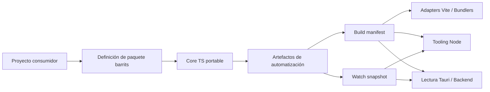

<div align="center">


# Barrits
### Barrels and Traits

[](https://www.npmjs.com/package/@zuccadev-labs/barrits)
[](https://jsr.io/@zuccadev-labs/barrits)
[](LICENSE)

[English](README.md) | **Español**

</div>

---

`barrits` es un motor de orquestación determinístico construido sobre el **Principio de Responsabilidad Única (SRP)**. Provee un grafo de descubrimiento a nivel sintáctico, resolución predictiva de módulos y artefactos de automatización contract-first, permitiendo aprovisionar ecosistemas distribuidos con precísión de configuración cero y sin vendor lock-in.

A diferencia del tooling de bundlers convencional o los orquestadores de monorepo, Barrits opera directamente en la **capa AST**: extrae contratos declarados (Traits, JSDoc, tipos estrictos), sella cada build con hashes de integridad criptográfica y expone Domain APIs fuertemente tipadas, completamente agnósticas del runtime y el framework.

La versión actual apunta a ecosistemas TypeScript y JavaScript. La arquitectura es intencionalmente portable, con SDKs de Go y Rust en el roadmap bajo el mismo estándar de contrato.

---

## Por qué existe Barrits

En organizaciones de ingeniería a gran escala, el costo oculto no está en exportar funciones — está en que cada equipo reimplementa de forma independiente el discovery, la generación de manifests, los watchers, la integración con bundlers, la lectura de artefactos y las convenciones de proyecto.

Barrits elimina esa dispersión:

- El proyecto consumidor **declara** su forma una sola vez.
- El SDK **genera** artefactos de automatización estables y sellados.
- Los adapters y el tooling **consumen** esos artefactos sin inventar otra capa de integración.

---

## Comparativa del Ecosistema

La tabla contrasta los vacíos documentados en las herramientas establecidas versus el dominio específico que Barrits atiende:

| Herramienta | Foco Resolutivo | Vacíos Arquitectónicos Documentados | Dominio Específico de Barrits |
| :--- | :--- | :--- | :--- |
| **UnJS / Nitropack** | Paquetes independientes, agnósticos de runtime y composables bajo filosofía UNIX. Excelente para infraestructura universal y abstracción de entornos. | Ausencia de un macro-framework integrador. El desarrollador debe ensamblar piezas manualmente o depender de un meta-framework externo (ej. Nuxt). 60+ paquetes elevan la fricción de selección y combinación. | Barrits opera como un único motor determinístico de descubrimiento y orquestación con una sola superficie de API, eliminando el ensamble manual entre paquetes runtime-agnostic. |
| **Nx** | Plataforma integral de monorepo con análisis de grafo de dependencias, ejecución de tareas cacheadas y gobernanza arquitectónica. | Cambios en librerías compartidas producen invalidación de caché en cascada sobre todos los proyectos dependientes. La configuración precisa de `inputs/outputs` es crítica y propensa a errores. La caché remota óptima requiere Nx Cloud o inversión propia significativa. | Barrits aplica caché AST incremental a nivel de árbol sintáctico, calculando deltas por archivo en lugar de invalidar el grafo completo, reduciendo la superficie de recómputo independientemente del proveedor de CI. |
| **Turborepo** | Orquestador de tareas de alta velocidad con caché local y remoto integrado con Vercel. Minimalista e invasivo cero. | Sin gobernanza de límites arquitectónicos nativa. Sin generadores de código integrados. A escala alta, la ausencia de ejecución distribuida de tareas entre máquinas puede convertirse en cuello de botella en CI. | Barrits detecta colisiones de exportación y ciclos de dependencia entre dominios de forma determinística, proveyendo gobernanza de límites a nivel de grafo de descubrimiento sin configuración explícita. |

---

## Arquitectura



---

## Principios de Diseño

1. **SDK, no framework** — la unidad de organización es una superficie por lenguaje; Barrits no impone arquitectura de aplicación.
2. **Package-first antes que command-first** — la CLI existe como fallback operativo; el contrato de diseño vive en la definición del paquete.
3. **Contract-first** — manifests y snapshots son contratos de primera clase entre el motor y los consumidores de tooling.
4. **Core portable + adapters por runtime** — la lógica común no se duplica entre Node y Deno.
5. **Ejemplos como superficies de aceptación** — los ejemplos validan consumo real por escenario de integración.
6. **Documentation mesh** — uso, desarrollo e investigaciones viven en carriles separados.

---

## Cobertura Actual

| Superficie | Estado | Canal |
| :--- | :--- | :--- |
| Node.js tooling | Estable | npm |
| Deno tooling | Estable | JSR |
| Plugin Vite | Estable | npm |
| Plugin esbuild | Estable | npm |
| Plugin Rollup | Estable | npm |
| Plugin Webpack | Estable | npm |
| Ejemplos React, Vue, Solid, Svelte | Estables | npm |
| Ejemplo Tauri | Estable | npm |
| Ejemplo Bun | Estable | npm |

---

## Postura de Seguridad

Controles verificables en este repositorio:

- Los manifests y snapshots se leen a través de `barrits/consume` con parseo validado — sin acoplamiento improvisado por integración.
- El ejemplo Tauri aplica restricciones explícitas de rutas permitidas (`.cache/**`, `.barrits/**`), bloquea rutas absolutas y previene path traversal.
- Renderer y backend están aislados en Tauri para evitar acceso libre al filesystem desde el frontend.
- Validación CI cruzada por superficie ejecuta contra Node, Deno, bundlers y Tauri en cada cambio.
- `deno publish --dry-run` actúa como gate de publicación para cambios orientados a JSR.

Barrits reduce la superficie de error operacional y centraliza contratos de automatización. Está diseñado para integrarse dentro — no para reemplazar — el marco de seguridad de la organización adoptante.

Para política de disclosure y detalles de endurecimiento: [SECURITY.md](SECURITY.md).

---

## Estructura del Repositorio

```
/
├── packages/sdk/ts_js/        # Paquete publicable @zuccadev-labs/barrits
│   ├── src/                   # Core portable (orquestación, traits, lógica)
│   ├── adapters/              # Adapters runtime Node.js y Deno
│   ├── examples/              # Ejemplos de integración por entorno
│   ├── tests/                 # Suite de tests completa (65 tests)
│   └── benchmarks/            # Benchmarks de rendimiento
└── docs/                      # Documentación por propósito
    ├── users/                 # Instalación, uso, referencia de API
    ├── development/           # Arquitectura, internals, contribución
    ├── investigations/        # ADRs e historial de decisiones arquitectónicas
    ├── package/               # Versionado, CI/CD, gobernanza de releases
    └── agents/                # Skills de agentes e integraciones M2M
```

---

## Documentación

**Español**

- [docs/users/ES/packages/ts_js/00_indice.md](docs/users/ES/packages/ts_js/00_indice.md) — Índice de guía de usuario
- [docs/users/ES/packages/ts_js/09a_referencia-de-api-configuracion.md](docs/users/ES/packages/ts_js/09a_referencia-de-api-configuracion.md) — API: Configuración, Traits y Manifests
- [docs/users/ES/packages/ts_js/09b_referencia-de-api-algoritmos.md](docs/users/ES/packages/ts_js/09b_referencia-de-api-algoritmos.md) — API: Algoritmos
- [docs/users/ES/packages/ts_js/09c_referencia-de-api-consume-y-adapters.md](docs/users/ES/packages/ts_js/09c_referencia-de-api-consume-y-adapters.md) — API: Consume y Adapters
- [docs/development/ES/packages/ts_js/00_indice.md](docs/development/ES/packages/ts_js/00_indice.md) — Índice de guía de desarrollo
- [docs/investigations/ES/packages/ts_js/00_indice.md](docs/investigations/ES/packages/ts_js/00_indice.md) — Investigaciones y decisiones arquitectónicas
- [docs/package/README.md](docs/package/README.md) — Gobernanza de releases y CI/CD

**English**

- [docs/users/EN/packages/ts_js/00-index.md](docs/users/EN/packages/ts_js/00-index.md) — User guide index
- [packages/sdk/ts_js/README.md](packages/sdk/ts_js/README.md) — Package-level quick start
- [docs/development/EN/packages/ts_js/00-index.md](docs/development/EN/packages/ts_js/00-index.md) — Developer guide index

---

## Criterio de Evolución

La convención del monorepo sigue siendo `sdk`, no `framework`. La ruta de crecimiento natural añade SDKs adicionales bajo `packages/sdk/` manteniendo el mismo estándar de: core portable, adapters por runtime, ejemplos consumidores dentro del SDK, contratos operativos visibles y documentación separada por uso, desarrollo e investigación.
