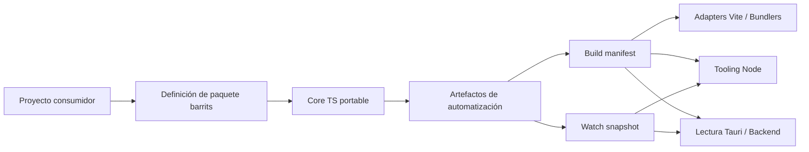
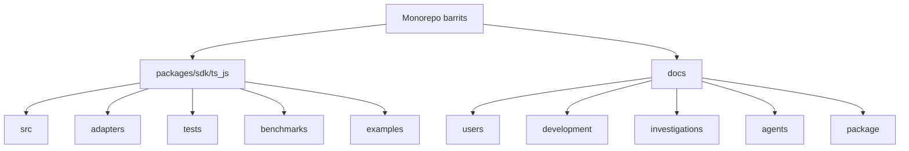

<div align="center">


# Barrits
### Barrels and Traits

[](https://www.npmjs.com/package/@zuccadev-labs/barrits)
[](https://jsr.io/@zuccadev-labs/barrits)
[](LICENSE)

[English](README.md) | **Español**

</div>

---

`barrits` es un motor de orquestación determinístico construido sobre el **Principio de Responsabilidad Única (SRP)**. Provee un grafo de descubrimiento a nivel sintáctico, resolución predictiva de módulos y artefactos de automatización contract-first, permitiendo aprovisionar ecosistemas distribuidos con precisión de configuración cero y sin vendor lock-in.

`barrits` es la fundación definitiva para la **Programación Orientada a Traits**, diseñada para convertir bases de código complejas en sistemas autoconfigurables.

A diferencia del tooling de bundlers convencional o los orquestadores de monorepo, Barrits opera directamente en la **capa AST**: extrae contratos declarados (Traits, JSDoc, tipos estrictos), sella cada build con hashes de integridad criptográfica y expone Domain APIs fuertemente tipadas, completamente agnósticas del runtime y el framework.

La versión actual apunta a ecosistemas TypeScript y JavaScript. La arquitectura es intencionalmente portable, con SDKs de Go y Rust en el roadmap bajo el mismo estándar de contrato.

---

## ¿Qué es la Programación Orientada a Traits?

Imagine que está armando un set de **piezas de Lego inteligentes**.

En lugar de escribir código espagueti para conectar manualmente la Base de Datos con la API y el Frontend, simplemente se coloca una **etiqueta** a cada pieza de código:

- "Esta función *necesita* una Base de Datos" → `@barrits-consumes database`
- "Esta función *provee* un usuario" → `@barrits-provides user`
- "Este endpoint *requiere* estado persistente" → `@barrits-state BaseDeDatos`

Barrits lee automáticamente esas etiquetas (Traits) desde el Árbol Sintáctico Abstracto (AST) y **arma el rompecabezas de dependencias automáticamente**. No se necesita configurar conexiones manuales, ni escribir complejos archivos de Inyección de Dependencias. Todo encaja de forma determinística, lo que lo hace perfecto no solo para equipos de ingeniería humanos, sino para que **Agentes de Inteligencia Artificial (LLMs)** puedan generar, entender y orquestar código en segundos.

### 2. El Contenedor ("La Caja")
El `BarritsIoCContainer` es la caja que sostiene todas las piezas. En lugar de que tú escribas `new BaseDeDatos()` manualmente dentro de tu controlador, el contenedor lee los traits y conecta las piezas por ti.

#### La Magia en Acción:

```ts
// 1. Construyes una pieza de Lego (una función)
/**
 * @barrits-trait http-endpoint
 * @barrits-state BaseDeDatos
 */
export async function getUser(id: string, { resolve }) {
  // La Base de Datos está mágicamente aquí
  const db = await resolve<any>("BaseDeDatos");
  return await db.get(["users", id]);
}
```

Detrás de escena, Barrits garantiza que antes de que `getUser` siquiera se ejecute:
1. Queda registrado como un endpoint HTTP.
2. Un esquema OpenAPI es autogenerado para él.
3. **Requiere** estado persistente vía la Base De Datos (inyectado de forma segura por el BaaS consumidor).

---

## ¿Por qué existe Barrits?

En organizaciones de ingeniería a gran escala, el costo oculto no está en exportar funciones — está en que cada equipo reimplementa de forma independiente el discovery, la generación de manifests, los watchers, la integración con bundlers, la lectura de artefactos y las convenciones de proyecto.

Barrits elimina esa dispersión:

- El proyecto consumidor **declara** su forma una sola vez.
- El SDK **genera** artefactos de automatización estables y sellados.
- Los adapters y el tooling **consumen** esos artefactos sin inventar otra capa de integración.

---

## Características Corporativas

A pesar de su simplicidad conceptual, Barrits es un motor de grado corporativo que garantiza:

| Característica | Descripción | Caso de Uso |
| :--- | :--- | :--- |
| **Inversión de Control (IoC) Dinámica** | Contenedor que lee el manifiesto AST y auto-inyecta dependencias sin configuración manual. | Un servicio de facturación declara `@barrits-consumes database` y recibe la conexión automáticamente. |
| **Generación Automática de OpenAPI** | Transforma los Traits descubiertos en documentación Swagger v3.1 al vuelo. | Los endpoints etiquetados con `http-endpoint` generan su esquema sin YAML duplicado. |
| **Trazabilidad Matemática (SHA-256)** | Cada build se sella criptográficamente para prevenir ataques en la cadena de suministro. | CI/CD verifica que el manifiesto no fue adulterado entre el build y el deploy. |
| **Agnóstico de Runtime y Framework** | Funciona idénticamente en Node.js, Deno, Bun, Tauri, React, Vue, Solid y Svelte. | Un mismo contrato de Traits se consume en el backend Deno y en el frontend React sin cambios. |

---

## Comparativa del Ecosistema

La tabla contrasta los vacíos documentados en las herramientas establecidas versus el dominio específico que Barrits atiende:

| Herramienta | Foco Resolutivo | Vacíos Arquitectónicos Documentados | Dominio Específico de Barrits |
| :--- | :--- | :--- | :--- |
| **UnJS / Nitropack** | Paquetes independientes, agnósticos de runtime y composables bajo filosofía UNIX. | Ausencia de un macro-framework integrador. 60+ paquetes elevan la fricción de selección y combinación. | Barrits opera como un único motor determinístico de descubrimiento y orquestación con una sola superficie de API. |
| **Nx** | Plataforma integral de monorepo con análisis de grafo de dependencias y gobernanza arquitectónica. | Cambios en librerías compartidas producen invalidación de caché en cascada. La caché remota óptima requiere Nx Cloud. | Barrits aplica caché AST incremental calculando deltas por archivo, reduciendo la superficie de recómputo. |
| **Turborepo** | Orquestador de tareas de alta velocidad con caché local y remoto integrado con Vercel. | Sin gobernanza de límites arquitectónicos nativa. Sin generadores de código integrados. | Barrits detecta colisiones de exportación y ciclos de dependencia entre dominios de forma determinística. |

---

## Arquitectura





---

## Principios de Diseño

1. **SDK, no framework** — la unidad de organización es una superficie por lenguaje; Barrits no impone arquitectura de aplicación.
2. **Package-first antes que command-first** — la CLI existe como fallback operativo; el contrato de diseño vive en la definición del paquete.
3. **Contract-first** — manifests y snapshots son contratos de primera clase entre el motor y los consumidores de tooling.
4. **Core portable + adapters por runtime** — la lógica común no se duplica entre Node y Deno.
5. **Ejemplos como superficies de aceptación** — los ejemplos validan consumo real por escenario de integración.
6. **Documentation mesh** — uso, desarrollo e investigaciones viven en carriles separados.

---

## Cobertura Actual

| Superficie | Estado | Canal |
| :--- | :--- | :--- |
| Node.js tooling | Estable | npm |
| Deno tooling | Estable | JSR |
| Deno BaaS Core (IoC, Schema) | Estable | JSR |
| Plugin Vite | Estable | npm |
| Plugin esbuild | Estable | npm |
| Plugin Rollup | Estable | npm |
| Plugin Webpack | Estable | npm |
| Ejemplos React, Vue, Solid, Svelte | Estables | npm |
| Ejemplo Tauri | Estable | npm |
| Ejemplo Bun | Estable | npm |

---

## Postura de Seguridad

Controles verificables en este repositorio:

- Los manifests y snapshots se leen a través de `barrits/consume` con parseo validado — sin acoplamiento improvisado por integración.
- Usa un **Manifest** unificado para vincular los metadatos estáticos con la ejecución en tiempo real sin `reflect-metadata`.
- **Superficie de Ataque I/O Cero (Delegación Estricta):** El motor core de orquestación no implementa adaptadores físicos de bases de datos o filesystem, eliminando por completo vulnerabilidades de path traversal y de cadena de suministro en la capa de datos desde el núcleo.
- El ejemplo Tauri aplica restricciones explícitas de rutas permitidas (`.cache/**`, `.barrits/**`), bloquea rutas absolutas y previene path traversal.
- Renderer y backend están aislados en Tauri para evitar acceso libre al filesystem desde el frontend.
- Validación CI cruzada por superficie ejecuta contra Node, Deno, bundlers y Tauri en cada cambio.
- `deno publish --dry-run` actúa como gate de publicación para cambios orientados a JSR.

Barrits reduce la superficie de error operacional y centraliza contratos de automatización. Está diseñado para integrarse dentro — no para reemplazar — el marco de seguridad de la organización adoptante.

Para política de disclosure y detalles de endurecimiento: [SECURITY.md](SECURITY.md).

---

## Estructura del Repositorio

```
/
├── packages/sdk/ts_js/        # Paquete publicable @zuccadev-labs/barrits
│   ├── src/                   # Core portable (orquestación, traits, lógica)
│   ├── adapters/              # Adapters runtime Node.js y Deno
│   ├── examples/              # Ejemplos de integración por entorno
│       ├── tests/                 # Suite de tests completa (946+ tests)
│   └── benchmarks/            # Benchmarks de rendimiento
└── docs/                      # Documentación por propósito
    ├── users/                 # Instalación, uso, referencia de API
    ├── development/           # Arquitectura, internals, contribución
    ├── investigations/        # ADRs e historial de decisiones arquitectónicas
    ├── package/               # Versionado, CI/CD, gobernanza de releases
    └── agents/                # Skills de agentes e integraciones M2M
```

---

## Documentación

**Español**

- [Índice de guía de usuario](docs/users/ES/packages/ts_js/00-indice.md)
- [Deno BaaS Core (IoC, Schema)](docs/users/ES/packages/ts_js/10-deno-baas-core.md)
- [Referencia completa de API](docs/users/ES/packages/ts_js/09-referencia-de-api.md)
- [Índice de guía de desarrollo](docs/development/ES/packages/ts_js/00-indice.md)
- [Investigaciones y decisiones arquitectónicas](docs/investigations/ES/packages/ts_js/00-indice.md)
- [Gobernanza de releases y CI/CD](docs/package/README.md)

**English**

- [User guide index](docs/users/EN/packages/ts_js/00-index.md)
- [Deno BaaS Core (IoC, Schema)](docs/users/EN/packages/ts_js/10-deno-baas-core.md)
- [Full API reference](docs/users/EN/packages/ts_js/09-api-reference.md)
- [Package-level quick start](packages/sdk/ts_js/README.md)
- [Developer guide index](docs/development/EN/packages/ts_js/00-index.md)
- [Release and CI/CD governance](docs/package/README.md)

---

## Criterio de Evolución

La convención del monorepo sigue siendo `sdk`, no `framework`. La ruta de crecimiento natural añade SDKs adicionales bajo `packages/sdk/` manteniendo el mismo estándar de: core portable, adapters por runtime, ejemplos consumidores dentro del SDK, contratos operativos visibles y documentación separada por uso, desarrollo e investigación.
