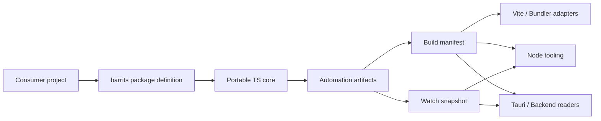
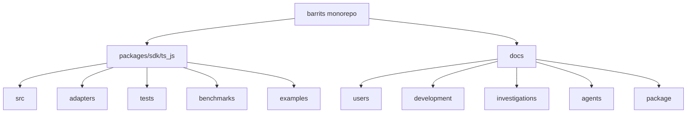

<div align="center">


# Barrits
### Barrels and Traits

[](https://www.npmjs.com/package/@zuccadev-labs/barrits)
[](https://jsr.io/@zuccadev-labs/barrits)
[](LICENSE)

**[English](README.md)** | [Español](README.es.md)

</div>

# Barrits

`barrits` is a deterministic orchestration engine built on the **Single Responsibility Principle (SRP)**. It provides a syntax-level discovery graph, predictive module resolution, and contract-first automation artifacts — enabling distributed ecosystems to be provisioned with zero-config, zero-lockin precision.

`barrits` is the ultimate foundation for **Trait-Oriented Programming**, designed to turn complex codebases into self-configuring systems.

Unlike conventional bundler tooling or monorepo orchestrators, Barrits operates directly at the **AST layer**: it extracts declared contracts (Traits, JSDoc, strict types), seals every build with cryptographic integrity hashes, and exposes strongly-typed Domain APIs that are fully agnostic of runtime and framework.

The current release targets TypeScript and JavaScript ecosystems. The architecture is intentionally portable, with Go and Rust SDKs on the roadmap under the same contract standard.

---

## What is Trait-Oriented Programming?

Imagine building a set of **smart Lego pieces**.

Instead of writing spaghetti code to manually connect the Database to the API and the Frontend, simply place a **tag** on each piece of code:

- "This function *needs* a Database" → `@barrits-consumes database`
- "This function *provides* a user" → `@barrits-provides user`
- "This endpoint *requires* persistent state" → `@barrits-state Database`

Barrits automatically reads those tags (Traits) from the Abstract Syntax Tree (AST) and **builds the dependency puzzle automatically**. There is no need to configure manual connections or write complex Dependency Injection files. Everything clicks together deterministically, making it perfect not only for human engineering teams, but for **Artificial Intelligence Agents (LLMs)** to generate, understand, and orchestrate code in seconds.

### How does it work in practice?

```ts
/**
 * @barrits-trait
 * @barrits-consumes database
 * @barrits-provides user
 * @barrits-state Database
 */
export async function getUser(id: string) {
  const db = await resolve<any>("Database");
  return await db.get(["users", id]);
}
```

With these three lines of JSDoc, Barrits understands that this function:
1. **Needs** a database connection (auto-injected via IoC).
2. **Provides** the "user" capability for other modules to consume.
3. **Requires** persistent state via the Database (securely connected with zero configuration).

---

## Why Barrits Exists

In large-scale engineering organizations, the hidden cost is not exporting functions — it is every team independently reimplementing discovery, manifest generation, watchers, bundler integration, artifact reading, and project conventions in isolation.

Barrits eliminates that dispersion:

- The consumer project **declares** its shape once.
- The SDK **generates** stable, sealed automation artifacts.
- Adapters and tooling **consume** those artifacts without inventing another integration layer.

---

## Corporate-Grade Features

Despite its conceptual simplicity, Barrits is an enterprise-grade engine that guarantees:

| Feature | Description | Use Case |
| :--- | :--- | :--- |
| **Dynamic Inversion of Control (IoC)** | Container that reads the AST manifest and auto-injects dependencies without manual configuration. | A billing service declares `@barrits-consumes database` and receives the connection automatically. |
| **Automatic OpenAPI Generation** | Transforms discovered Traits into Swagger v3.1 documentation on the fly. | Endpoints tagged with `http-endpoint` generate their schema without duplicated YAML. |
| **Mathematical Traceability (SHA-256)** | Every build is cryptographically sealed to prevent supply chain attacks. | CI/CD verifies the manifest was not tampered with between build and deploy. |
| **Runtime & Framework Agnostic** | Works identically across Node.js, Deno, Bun, Tauri, React, Vue, Solid, and Svelte. | The same Trait contract is consumed in the Deno backend and the React frontend without changes. |

---

## Ecosystem Comparison

The table below contrasts the documented gaps in established tooling against the specific domain Barrits addresses:

| Tool | Core Focus | Documented Gaps | Barrits Domain |
| :--- | :--- | :--- | :--- |
| **UnJS / Nitropack** | Independent, runtime-agnostic, composable packages under UNIX philosophy. | No integrated macro-framework out of the box. 60+ packages increase selection and combination friction. | Barrits operates as a single deterministic discovery and orchestration engine with one unified API surface. |
| **Nx** | Comprehensive monorepo platform with dependency graph analysis and architectural governance. | Shared library changes cause cascading cache invalidations. Optimal remote caching requires Nx Cloud. | Barrits applies incremental AST-level caching, computing deltas per file to reduce recomputation surface. |
| **Turborepo** | High-speed task orchestration for monorepos with local and Vercel-integrated remote caching. | No native architectural boundary enforcement. No built-in code generators. | Barrits detects export collisions and dependency cycles across domains deterministically. |

---

## Architecture





---

## Design Principles

1. **SDK, not framework** — the primary unit of organization is a surface per language; Barrits does not impose an application architecture.
2. **Package-first before command-first** — the CLI exists as an operational fallback; the design contract lives in the package definition.
3. **Contract-first** — manifests and snapshots are first-class contracts between the engine and tooling consumers.
4. **Portable core + runtime adapters** — shared logic is never duplicated across Node and Deno.
5. **Examples as acceptance surfaces** — examples validate real consumption by integration scenario.
6. **Documentation mesh** — usage, development, and investigations live in separate lanes.

---

## Current Scope

| Surface | Status | Channel |
| :--- | :--- | :--- |
| Node.js tooling | Stable | npm |
| Deno tooling | Stable | JSR |
| Deno BaaS Core (IoC, Schema) | Stable | JSR |
| Vite plugin | Stable | npm |
| esbuild plugin | Stable | npm |
| Rollup plugin | Stable | npm |
| Webpack plugin | Stable | npm |
| React, Vue, Solid, Svelte examples | Stable | npm |
| Tauri example | Stable | npm |
| Bun example | Stable | npm |

---

## Security Posture

Verifiable controls in this repository:

- Manifests and snapshots are read through `barrits/consume` with validated parsing — no improvised artifact coupling per integration.
- Uses a unified **Manifest** to bridge compile-time metadata to runtime execution without `reflect-metadata`.
- **Zero I/O Attack Surface (Strict Delegation):** The core orchestration engine does not implement physical database or file-system adapters, completely eliminating path traversal and data-layer supply-chain vulnerabilities from the core.
- The Tauri example enforces explicit allowed-path restrictions (`.cache/**`, `.barrits/**`), blocks absolute paths, and prevents path traversal attacks.
- Renderer and backend are isolated in Tauri to prevent unrestricted filesystem access from the frontend.
- Cross-surface CI validation runs against Node, Deno, bundlers, and Tauri on each change.
- `deno publish --dry-run` acts as a publication gate for JSR-facing changes.

Barrits reduces operational error surface and centralizes automation contracts. It is designed to be integrated within — not to replace — the security framework of the adopting organization.

For disclosure policy and repository hardening details: [SECURITY.md](SECURITY.md).

---

## Repository Structure

```
/
├── packages/sdk/ts_js/        # Publishable @zuccadev-labs/barrits package
│   ├── src/                   # Portable core (orchestration, traits, logic)
│   ├── adapters/              # Node.js and Deno runtime adapters
│   ├── examples/              # Real integration examples by environment
│   ├── tests/                 # Full test suite (65 tests)
│   └── benchmarks/            # Performance benchmarks
└── docs/                      # Documentation by purpose
    ├── users/                 # Installation, usage, API reference
    ├── development/           # Architecture, internals, contributions
    ├── investigations/        # ADRs and architectural decision history
    ├── package/               # Versioning, CI/CD, release governance
    └── agents/                # Agent skills and M2M integration guides
```

---

## Documentation

**English**

- [User guide index](docs/users/EN/packages/ts_js/00-index.md)
- [Deno BaaS Core (IoC, Schema)](docs/users/EN/packages/ts_js/10-deno-baas-core.md)
- [Full API reference](docs/users/EN/packages/ts_js/09-api-reference.md)
- [Package-level quick start](packages/sdk/ts_js/README.md)
- [Developer guide index](docs/development/EN/packages/ts_js/00-index.md)
- [Release and CI/CD governance](docs/package/README.md)

**Español**

- [Índice de guía de usuario](docs/users/ES/packages/ts_js/00-indice.md)
- [Deno BaaS Core (IoC, Schema)](docs/users/ES/packages/ts_js/10-deno-baas-core.md)
- [Referencia completa de API](docs/users/ES/packages/ts_js/09-referencia-de-api.md)
- [Índice de guía de desarrollo](docs/development/ES/packages/ts_js/00-indice.md)
- [Investigaciones y decisiones arquitectónicas](docs/investigations/ES/packages/ts_js/00-indice.md)

---

## Evolution Criterion

The monorepo convention remains `sdk`, not `framework`. The natural growth path adds additional SDKs under `packages/sdk/` while maintaining the same standard of portable core, runtime adapters, consumer examples, visible operational contracts, and separated documentation.
