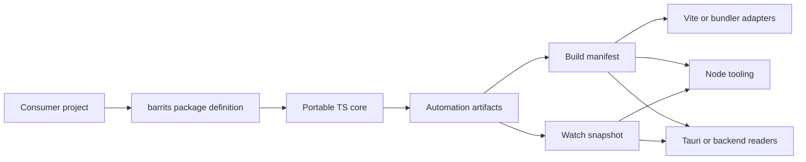
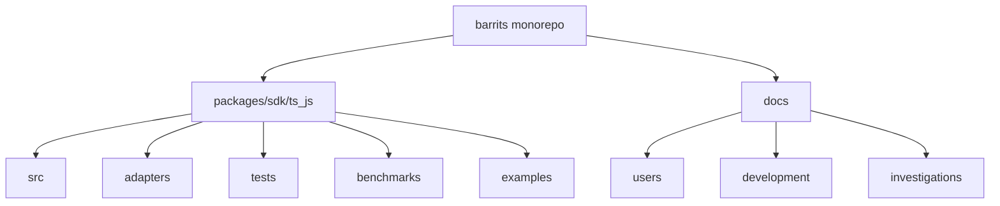

# Barrits - Barrels and Traits

## Open SDK monorepo for contract-first automation

`barrits` es el monorepo que aloja SDKs por lenguaje. Hoy el SDK activo es `barrits`, orientado a TypeScript y JavaScript para integrar discovery, automatizacion package-first, manifests, snapshots y adapters de tooling sin obligar al consumidor a reconstruir esa logica en cada proyecto.

Yo organizo la raiz como coordinadora de monorepo y gobierno tecnico. No la trato como paquete publicable. El artefacto publicable vive dentro del SDK correspondiente.

Licencia actual del repositorio y del SDK activo: `MIT`.

## Estado del repositorio

- monorepo de SDKs con release engineering preparado para npm y JSR
- SDK activo `barrits` validado con build, typecheck, tests y ejemplos reales
- documentacion separada por uso, desarrollo, investigacion y publicacion
- licencia `MIT` con atribucion explicita al autor del repositorio

## CI/CD y ramas

El flujo operativo del repositorio queda definido asi:

- `feature/*` o cualquier rama de trabajo entra por PR hacia `dev`
- `dev` concentra integracion, validacion y prereleases
- `main` queda reservado para releases estables
- las publicaciones no salen por push directo a ramas, salen por tags creados despues de un PR mergeado

### Que pasa cuando hago push o PR

| Evento | Pipeline | Jobs que se ejecutan |
| --- | --- | --- |
| Push a `dev` | CI de integracion + seguridad | `typecheck -> build -> test -> examples -> jsr-dry-run` y `dependency-review or audit` |
| Push a `main` | CI estable + seguridad | `typecheck -> build -> test -> examples -> jsr-dry-run` y `dependency-review or audit` |
| PR hacia `dev` | CI de integracion + seguridad | `typecheck -> build -> test -> examples -> jsr-dry-run` y `dependency-review + audit` |
| PR hacia `main` | CI estable + seguridad | `typecheck -> build -> test -> examples -> jsr-dry-run` y `dependency-review + audit` |
| Push tag `pre-v*` | Prerelease | `validate-tag -> publish npm:next -> publish jsr -> GitHub prerelease` |
| Push tag `v*` | Release | `validate-tag -> publish npm:latest -> publish jsr -> GitHub release` |

### Reglas del flujo

1. una rama de trabajo nunca deberia publicar directo
2. si el cambio apunta a integracion o validacion intermedia, hago PR hacia `dev`
3. cuando `dev` queda listo para distribucion de prueba, subo la version prerelease en `package.json` y `jsr.json`, por ejemplo `0.2.0-rc.1`
4. luego creo y hago push del tag `pre-v0.2.0-rc.1`
5. cuando la integracion validada pasa a estable, hago PR de `dev` hacia `main`
6. despues del merge a `main`, subo la version estable, por ejemplo `0.2.0`
7. luego creo y hago push del tag `v0.2.0`

### Regla de tags

- `pre-vX.Y.Z-rc.N` publica prerelease desde `dev`
- `vX.Y.Z` publica release estable desde `main`
- el workflow valida que el commit etiquetado pertenezca a la rama correcta y que `package.json` y `jsr.json` coincidan con la version del tag

## Superficies cubiertas hoy

| Superficie | Estado | Canal principal |
| --- | --- | --- |
| Node.js tooling | listo | npm |
| Deno tooling | listo | JSR |
| Vite plugin | listo | npm |
| esbuild plugin | listo | npm |
| Rollup plugin | listo | npm |
| Webpack plugin | listo | npm |
| React, Vue, Solid, Svelte examples | listos | npm |
| Tauri example | listo | npm |

## Que es `barrits`

`barrits` es un SDK, no un framework.

Esa distincion es intencional:

- un SDK encapsula contratos, adapters, tooling y automatizacion reutilizable por runtime
- un framework impondria una arquitectura de aplicacion completa, y ese no es el objetivo aqui
- la unidad real de crecimiento del repo es `packages/sdk/<lenguaje>/`, no un stack full-stack opinionado

En la practica, `barrits` busca estandarizar tres cosas:

- como un proyecto declara su runtime y su dominio visible mediante `barrits/` o `src/barrits/`
- como se generan y consumen manifests y snapshots como contratos de automatizacion
- como bundlers, CLI, backend local y tooling leen ese contrato sin duplicar discovery ni reglas internas

## Que problema resuelve

En organizaciones grandes, el costo no suele estar solo en exportar funciones. El costo aparece cuando cada equipo reimplementa discovery, manifests, watchers, integracion con bundlers, lectura de artifacts y convenciones de proyecto de forma distinta.

`barrits` reduce esa dispersion con un modelo package-first y contract-first:

- el proyecto consumidor declara su forma
- el SDK genera artifacts operativos estables
- los adapters consumen esos artifacts en vez de inventar otra capa de integracion

## Valor

- estandariza una superficie transversal para Node.js, Deno, Vite y bundlers sin fragmentar el producto por equipo o runtime
- separa core portable, adapters y ejemplos reales para que la evolucion tecnica no rompa el contrato publico sin visibilidad
- convierte los ejemplos en proyectos consumidores ejecutables, no en demos decorativas, lo que mejora onboarding y validacion de integracion
- mantiene dos superficies de distribucion claras: npm desde `dist/` y JSR desde `jsr.json`
- documenta uso, desarrollo e investigacion por separado para que onboarding, mantenimiento y decisiones historicas no se mezclen

## Arquitectura

## Marco estandar del repositorio

Este repo sigue un marco tecnico simple y defendible:

1. `sdk` y no `framework`: la unidad de organizacion es una superficie por lenguaje.
2. `package-first` antes que `command-first`: la CLI existe, pero como fallback operativo, diagnostico y automatizacion puntual.
3. `contract-first`: manifests y snapshots son contratos entre el motor y el tooling.
4. `portable core + runtime adapters`: la logica comun no se duplica entre Node y Deno.
5. `examples as acceptance surfaces`: los ejemplos validan consumo real por tipo de experiencia.
6. `documentation mesh`: uso, desarrollo e investigacion viven en carriles separados.

## Alcance actual

El alcance real hoy es este:

- SDK TypeScript y JavaScript publicable en [packages/sdk/ts_js](packages/sdk/ts_js)
- adapters para Node.js y Deno
- plugins para Vite, esbuild, Rollup y Webpack
- helpers de consumo para leer manifests y snapshots sin arrastrar tooling innecesario
- ejemplos ejecutables para Node.js, Deno, Bun, React, Vue, Solid, Svelte, bundlers y Tauri
- pipeline de validacion con build, tests, ejemplos representativos y dry-run de JSR

No presento este repositorio como plataforma multi-SDK completa hoy. Lo presento como un monorepo preparado para crecer con ese estandar sin rehacer la raiz cada vez que se incorpore otro lenguaje.

## Postura de seguridad actual

La postura de seguridad actual es seria, pero no la vendo como certificacion externa ni como auditoria formal cerrada.

Controles verificables hoy en el repo:

- lectura resumida y validada de manifests y snapshots mediante `barrits/consume`, en vez de acoplar parseo improvisado en cada integracion
- ejemplo Tauri con restriccion explicita de rutas permitidas a `.cache/**` y `.barrits/**`, bloqueo de rutas absolutas y de path traversal
- separacion entre renderer y backend en Tauri para no exponer acceso libre al filesystem al frontend
- validacion cruzada por superficie: Node, Deno, bundlers y Tauri se comprueban segun el cambio realizado
- `deno publish --dry-run` como gate previo para la superficie JSR cuando se toca publicacion o compatibilidad Deno

Lo que no afirmo desde este README:

- no afirmo una certificacion SOC 2, ISO 27001 o equivalente
- no afirmo una auditoria externa de seguridad independiente cerrada
- no afirmo que el SDK elimine la necesidad de controles de seguridad del producto consumidor

La posicion correcta es esta: `barrits` reduce superficie de error operacional y centraliza contratos de automatizacion, pero debe integrarse dentro del marco de seguridad de la organizacion que lo adopta.

Para la politica de disclosure y el marco de endurecimiento del repositorio, yo uso [SECURITY.md](SECURITY.md).

## Estructura actual

- [packages/sdk/ts_js](packages/sdk/ts_js): paquete publicable `barrits`
- [packages/sdk/ts_js/examples](packages/sdk/ts_js/examples): consumidores e integraciones reales del SDK TS/JS
- [docs](docs): documentacion separada por uso, desarrollo e investigacion

## Cobertura de publicacion actual

Con los dos canales actuales cubro todos los ejemplos visibles del repo:

- `npm` cubre Node.js, React, Vue, Solid, Svelte, bundlers y Tauri
- `npm prerelease` usa el dist-tag `next` cuando publico desde `pre-v*`
- `JSR` cubre Deno tanto para prerelease como para release estable, segun la version definida en `jsr.json`

Hoy no necesito otro registro publico para cubrir los recorridos actuales. Si la corporacion requiere distribucion interna, prefiero un mirror o registry corporativo antes que abrir un tercer canal publico.

## Como leer este repositorio

- cada SDK vive en `packages/sdk/<lenguaje>/`
- los ejemplos visibles viven dentro del SDK correspondiente
- la documentacion principal en espanol sigue el patron `docs/<area>/ES/packages/<sdk>/`

## Punto de entrada recomendado

Si yo quiero entender el producto y entrar por la capa correcta, leo esto primero:

- [docs/README.md](docs/README.md)
- [docs/users/README.md](docs/users/README.md)
- [docs/development/README.md](docs/development/README.md)
- [docs/investigations/README.md](docs/investigations/README.md)
- [docs/package/README.md](docs/package/README.md)
- [packages/sdk/ts_js/README.md](packages/sdk/ts_js/README.md)
- [docs/users/ES/packages/ts_js/00_indice.md](docs/users/ES/packages/ts_js/00_indice.md)
- [docs/users/ES/packages/ts_js/examples/00_indice.md](docs/users/ES/packages/ts_js/examples/00_indice.md)
- [docs/users/ES/packages/ts_js/09_referencia-de-api.md](docs/users/ES/packages/ts_js/09_referencia-de-api.md)
- [docs/development/ES/packages/ts_js/00_indice.md](docs/development/ES/packages/ts_js/00_indice.md)
- [docs/investigations/ES/packages/ts_js/00_indice.md](docs/investigations/ES/packages/ts_js/00_indice.md)

## Criterio de evolucion

La convencion del monorepo sigue siendo `sdk`, no `framework`. La ruta de crecimiento natural es sumar otros SDKs bajo `packages/sdk/` manteniendo el mismo estandar de:

- core portable
- adapters por runtime o tooling
- ejemplos consumidores dentro del SDK
- contratos operativos visibles
- documentacion separada por uso, desarrollo e investigacion
