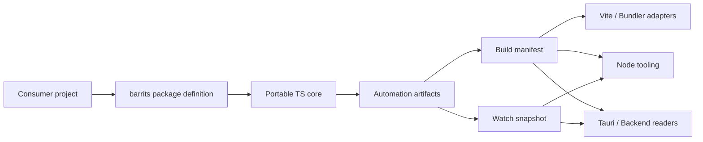
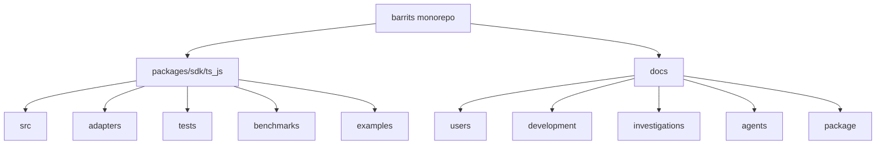

<div align="center">


# Barrits
### Barrels and Traits

[](https://www.npmjs.com/package/@zuccadev-labs/barrits)
[](https://jsr.io/@zuccadev-labs/barrits)
[](LICENSE)

**[English](README.md)** | [Español](README.es.md)

</div>

# Barrits

`barrits` is a deterministic orchestration engine built on the **Single Responsibility Principle (SRP)**. It provides a syntax-level discovery graph, predictive module resolution, and contract-first automation artifacts — enabling distributed ecosystems to be provisioned with zero-config, zero-lockin precision.

Unlike conventional bundler tooling or monorepo orchestrators, Barrits operates directly at the **AST layer**: it extracts declared contracts (Traits, JSDoc, strict types), seals every build with cryptographic integrity hashes, and exposes strongly-typed Domain APIs that are fully agnostic of runtime and framework.

The current release targets TypeScript and JavaScript ecosystems. The architecture is intentionally portable, with Go and Rust SDKs on the roadmap under the same contract standard.

---

## Why Barrits Exists

In large-scale engineering organizations, the hidden cost is not exporting functions — it is every team independently reimplementing discovery, manifest generation, watchers, bundler integration, artifact reading, and project conventions in isolation.

Barrits eliminates that dispersion:

- The consumer project **declares** its shape once.
- The SDK **generates** stable, sealed automation artifacts.
- Adapters and tooling **consume** those artifacts without inventing another integration layer.

---

## Ecosystem Comparison

The table below contrasts the documented gaps in established tooling against the specific domain Barrits addresses:

| Tool | Core Focus | Documented Gaps | Barrits Domain |
| :--- | :--- | :--- | :--- |
| **UnJS / Nitropack** | Independent, runtime-agnostic, composable packages under UNIX philosophy. Excellent for universal infrastructure and environment abstraction. | No integrated macro-framework out of the box. Developers must manually assemble pieces or depend on a higher-level meta-framework (e.g. Nuxt). 60+ packages increase selection and combination friction. | Barrits operates as a single deterministic discovery and orchestration engine with one unified API surface, eliminating manual assembly across runtime-agnostic packages. |
| **Nx** | Comprehensive monorepo platform with sophisticated dependency graph analysis, cached task execution, and architectural governance. | Shared library changes cause cascading cache invalidations across all dependent projects. Precise `inputs/outputs` configuration is critical and error-prone; an incorrect definition produces inconsistent builds between local and CI. Optimal remote caching requires adopting the Nx Cloud managed service or significant self-hosted infrastructure investment. | Barrits applies incremental AST-level caching, computing deltas per file rather than per full-graph invalidation, reducing recomputation surface independently of the CI provider. |
| **Turborepo** | High-speed task orchestration for monorepos with local and Vercel-integrated remote caching. Zero-invasive and minimal. | No native architectural boundary enforcement (unauthorized cross-module imports). No built-in code generators. At high scale, the absence of native distributed task execution across machines can become a CI pipeline bottleneck. | Barrits detects export collisions and dependency cycles across domains deterministically, providing boundary governance at discovery-graph level without requiring explicit import rule configuration. |

---

## Architecture





---

## Design Principles

1. **SDK, not framework** — the primary unit of organization is a surface per language; Barrits does not impose an application architecture.
2. **Package-first before command-first** — the CLI exists as an operational fallback; the design contract lives in the package definition.
3. **Contract-first** — manifests and snapshots are first-class contracts between the engine and tooling consumers.
4. **Portable core + runtime adapters** — shared logic is never duplicated across Node and Deno.
5. **Examples as acceptance surfaces** — examples validate real consumption by integration scenario.
6. **Documentation mesh** — usage, development, and investigations live in separate lanes.

---

## Current Scope

| Surface | Status | Channel |
| :--- | :--- | :--- |
| Node.js tooling | Stable | npm |
| Deno tooling | Stable | JSR |
| Vite plugin | Stable | npm |
| esbuild plugin | Stable | npm |
| Rollup plugin | Stable | npm |
| Webpack plugin | Stable | npm |
| React, Vue, Solid, Svelte examples | Stable | npm |
| Tauri example | Stable | npm |
| Bun example | Stable | npm |

---

## Security Posture

Verifiable controls in this repository:

- Manifests and snapshots are read through `barrits/consume` with validated parsing — no improvised artifact coupling per integration.
- The Tauri example enforces explicit allowed-path restrictions (`.cache/**`, `.barrits/**`), blocks absolute paths, and prevents path traversal attacks.
- Renderer and backend are isolated in Tauri to prevent unrestricted filesystem access from the frontend.
- Cross-surface CI validation runs against Node, Deno, bundlers, and Tauri on each change.
- `deno publish --dry-run` acts as a publication gate for JSR-facing changes.

Barrits reduces operational error surface and centralizes automation contracts. It is designed to be integrated within — not to replace — the security framework of the adopting organization.

For disclosure policy and repository hardening details: [SECURITY.md](SECURITY.md).

---

## Repository Structure

```
/
├── packages/sdk/ts_js/        # Publishable @zuccadev-labs/barrits package
│   ├── src/                   # Portable core (orchestration, traits, logic)
│   ├── adapters/              # Node.js and Deno runtime adapters
│   ├── examples/              # Real integration examples by environment
│   ├── tests/                 # Full test suite (65 tests)
│   └── benchmarks/            # Performance benchmarks
└── docs/                      # Documentation by purpose
    ├── users/                 # Installation, usage, API reference
    ├── development/           # Architecture, internals, contributions
    ├── investigations/        # ADRs and architectural decision history
    ├── package/               # Versioning, CI/CD, release governance
    └── agents/                # Agent skills and M2M integration guides
```

---

## Documentation

**English**

- [docs/users/EN/packages/ts_js/00-index.md](docs/users/EN/packages/ts_js/00-index.md) — User guide index
- [packages/sdk/ts_js/README.md](packages/sdk/ts_js/README.md) — Package-level quick start
- [docs/development/EN/packages/ts_js/00-index.md](docs/development/EN/packages/ts_js/00-index.md) — Developer guide index
- [docs/package/README.md](docs/package/README.md) — Release and CI/CD governance

**Español**

- [docs/users/ES/packages/ts_js/00_indice.md](docs/users/ES/packages/ts_js/00_indice.md) — Índice de guía de usuario
- [docs/users/ES/packages/ts_js/09_referencia-de-api.md](docs/users/ES/packages/ts_js/09_referencia-de-api.md) — Referencia completa de API
- [docs/development/ES/packages/ts_js/00_indice.md](docs/development/ES/packages/ts_js/00_indice.md) — Índice de guía de desarrollo
- [docs/investigations/ES/packages/ts_js/00_indice.md](docs/investigations/ES/packages/ts_js/00_indice.md) — Investigaciones y decisiones arquitectónicas

---

## Evolution Criterion

The monorepo convention remains `sdk`, not `framework`. The natural growth path adds additional SDKs under `packages/sdk/` while maintaining the same standard of portable core, runtime adapters, consumer examples, visible operational contracts, and separated documentation.
