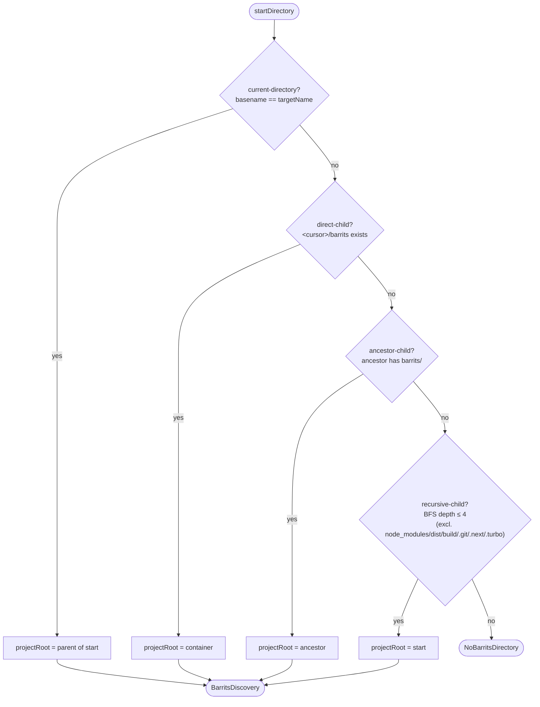

# Project Structure and Discovery

Barrits is **package-first**: the SDK derives discovery, manifest generation, and watch behavior from a single declaration in the consumer project. This guide explains how the SDK **locates and reads** your structure after you create it — covering the folder layout, the `barrits.config.*` resolution, the four discovery strategies, and how the manifest is read per runtime and use case.

## 1. Project layout

A consumer project typically contains three kinds of artifacts:

| Artifact | Default location | Purpose |
| :--- | :--- | :--- |
| **Visible domain folder** | `barrits/` (or `.barrits/`) at the execution root or a subdirectory | Your traits, JSDoc contracts, and source the engine discovers. |
| **Automation artifacts** | `<automationDirectory>/` (default `.barrits/`) | Generated `build-manifest.json` and `watch-snapshot.json` produced by the CLI or bundler plugins. |
| **Package configuration** | `barrits.config.ts` (also `.mts` / `.js` / `.mjs`) | Declares runtime, watch policy, namespace, discovery roots, and contracts. |

You can place the visible domain folder at the project root, in a subdirectory, or even rename it — the discovery engine resolves it automatically (see §3). To separate automation output from the visible domain, set a custom `automationDirectory` in `barrits.config.ts`.

## 2. Configuration resolution

`resolveBarritsConfig(options)` merges two sources, with **explicit `options` overriding the file**:

1. `findBarritsConfigFile(projectRoot)` looks for `barrits.config.ts` → `.mts` → `.js` → `.mjs` (in that order) in the project root. It is supported on Node and Deno.
2. The loaded module's `default` export (or `barritsConfig` / `config` named export) is parsed and validated.
3. The merged object is normalized into `ResolvedBarritsConfig` (runtime, watch, namespace, manifest path, discovery roots, trait conflict strategy, etc.).

The `namespace` field here is what makes the **main API name customizable** (see [API Reference — Package Config](09a-api-reference-package-config.md)).

## 3. Discovery strategies (how the SDK finds the structure)

`findBarritsDirectory(adapter, options)` walks the filesystem using a `RuntimeFileSystemAdapter` and returns a `BarritsDiscovery` describing where the domain folder lives and which strategy matched. The four strategies, in evaluation order:

| Strategy | When it matches | `projectRoot` resolved to |
| :--- | :--- | :--- |
| `current-directory` | The starting directory's basename equals the target name (`barrits` by default). | Parent of the starting directory. |
| `direct-child` | `<cursor>/barrits` exists as a directory. | The directory containing the match. |
| `ancestor-child` | An ancestor directory has a `barrits` child. | That ancestor. |
| `recursive-child` | A descendant (BFS, up to `maxDepth`, default **4**) has a `barrits` directory, excluding `node_modules`, `dist`, `build`, `.git`, `.next`, `.turbo`. | The starting directory. |

Key knobs (all optional): `targetName` (default `"barrits"`), `maxDepth` (default `4`), `startDirectory`, and `ignoredDirectories`. The runtime adapter is selected automatically by `createRuntimeFileSystemAdapter()` — Deno uses `DenoFileSystemAdapter`, while Node and Bun use `NodeFileSystemAdapter`.



## 4. Manifest creation

Once the structure is discovered, the engine builds an integration graph and serializes it:

- `createBuildManifest(graph, filters)` → `stringifyBuildManifest(graph, filters)` produces the JSON payload.
- The CLI `build` command (or a bundler plugin) writes `<automationDirectory>/build-manifest.json`.
- `watch` and `dev` modes write `<automationDirectory>/watch-snapshot.json`.

The manifest carries domains, exports, trait descriptors, import actions, collisions, and a SHA-256 checksum for supply-chain integrity.

## 5. Reading the manifest per runtime (the consumption contract)

Tooling never re-implements discovery — it consumes the generated artifact through a small, typed reader. Choose the reader that matches your runtime:

| Runtime / use case | Subpath | Readers |
| :--- | :--- | :--- |
| **Node.js / Bun** | `@zuccadev-labs/barrits/node` | `readNodeBuildManifest(path)`, `readNodeBuildManifestSummary(path)`, `readNodeWatchSnapshot(path)`, `readNodeLanguageToolSnapshot(path)` |
| **Deno / JSR** | `@zuccadev-labs/barrits/deno` | `readDenoBuildManifest(path)`, `readDenoBuildManifestSummary(path)`, `readDenoWatchSnapshot(path)`, `readDenoLanguageToolSnapshot(path)` |
| **Frontend (Vite/React/Vue/Solid/Svelte)** | plugin-injected `virtual:barrits/manifest` | Consume the injected object with `createBuildManifestSummary(manifest)` inside the app. |
| **Tauri / desktop backend** | `@zuccadev-labs/barrits/consume` + injected `readTextFile` | `readBuildManifest(path, readTextFile)` delegated to the Rust backend (explicit allowed-path restrictions). |
| **Runtime-agnostic / serverless** | `@zuccadev-labs/barrits/consume` | `readBuildManifest(path, readTextFile)`, `readWatchSnapshot(path, readTextFile)`, `readLanguageToolSnapshot(path, readTextFile)`, `parseBuildManifest(source)`, `parseWatchSnapshot(source)` |

When filesystem access must be delegated (Tauri backend, serverless reader), pass an injectable `readTextFile(path)` function; the `consume` subpath handles structural validation of the returned payload.

## 6. Recommended structure per case

| Case | Layout | Read via |
| :--- | :--- | :--- |
| Node.js backend library | Root `barrits/` + `barrits.config.ts` (`runtime: "node"`) | `@zuccadev-labs/barrits/node` or `/consume` |
| Deno / JSR service | Root `barrits/` + `barrits.config.ts` (`runtime: "deno"`) | `@zuccadev-labs/barrits/deno` |
| Bun runtime | Same as Node; `@zuccadev-labs/barrits/bun` reuses the Node adapter | `@zuccadev-labs/barrits/node` |
| Frontend app (Vite) | `src/barrits/` + `barrits.config.ts` (`runtime: "react"`/`"browser"`) | `virtual:barrits/manifest` + `createBuildManifestSummary` |
| Tauri desktop | `barrits/` + `barrits.config.ts` | `/consume` with backend-injected reader |
| Monorepo package | `barrits/` per package | Discovery walks ancestors (`ancestor-child`) |

## 7. Worked example

Consider a Node.js backend service with the following layout:

```text
my-service/
├── barrits.config.ts          # runtime: "node", namespace: "corpAgent"
├── barrits/
│   ├── logic/
│   │   ├── order-by.ts        # export function orderBy(...)
│   │   └── search-algorithms/
│   │       ├── binary-search.ts
│   │       └── index.ts
│   ├── routes/
│   │   └── health.ts
│   └── traits/
│       ├── user-service.ts
│       └── http-handler.ts
├── src/
│   └── main.ts                # import { createBarrits } from "@zuccadev-labs/barrits"
└── package.json
```

Trace the lifecycle:

1. **Config** — `resolveBarritsConfig()` finds `barrits.config.ts` at the project root (Node/Deno only) and normalizes it. The `namespace: "corpAgent"` field makes the custom root API name `corpAgent`, so `createBarrits<"corpAgent">()` returns a typed `{ corpAgent, barrits, brt, config }`.
2. **Discovery** — starting from `src/main.ts`'s directory, `findBarritsDirectory()` evaluates `direct-child` first: `<root>/barrits` exists, so `projectRoot` resolves to `<root>` and the domain folder is `<root>/barrits`.
3. **Manifest** — `barrits build` (CLI) walks the domain folder, builds the integration graph, and writes `.barrits/build-manifest.json` with a SHA-256 checksum.
4. **Consumption** — a Node tool reads it through `@zuccadev-labs/barrits/node`: `readNodeBuildManifest(".barrits/build-manifest.json")`. No discovery is re-run; the tool consumes the generated artifact.

**Variant — monorepo package.** If the consumer lives in `packages/checkout/` with its own `barrits/` and `barrits.config.ts`, discovery from `packages/checkout/src/index.ts` walks ancestors and matches `ancestor-child`, resolving `projectRoot` to `packages/checkout/`.

**Variant — renamed domain folder.** Set `targetName: "domain"` in `barrits.config.ts`; discovery then looks for `domain/` instead of `barrits/` using the same four strategies.

## Related

- [Automation and Configuration](05-automation-and-configuration.md)
- [Manifests, Bundlers, and Consumption](07-manifests-bundlers-and-consumption.md)
- [API Reference — Consume and Adapters](09c-api-reference-consume-and-adapters.md)
- [API Reference — Package Config](09a-api-reference-package-config.md)

---

[← Examples and Walkthroughs](03-examples-and-walkthroughs.md) | [API Reference →](09-api-reference.md)
